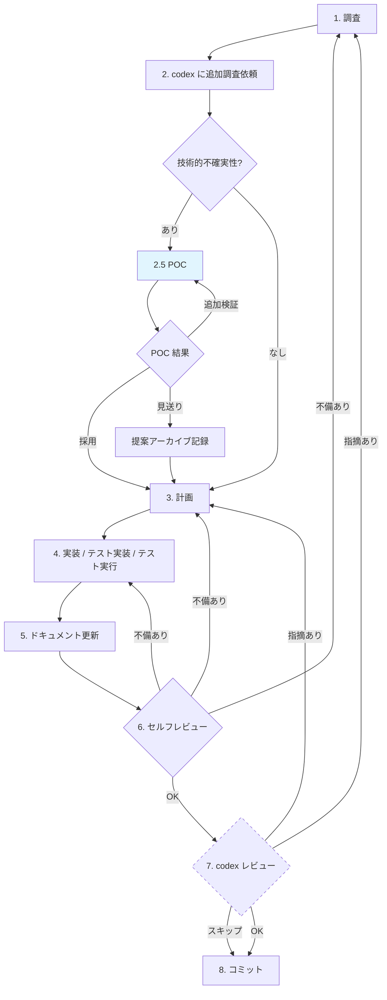

# nekonote 開発フロー（厳守）

## Phase 0: 必読（コードに触れる前に必ず実行）

**以下の2ファイルを Read ツールで読む。スキップ禁止。**

1. `CONCEPT.md` — プロジェクトの憲法。判断に迷ったら最優先。
2. `CLAUDE.md` — 開発規約と開発フロー。

読んだ上で、今回の作業が CONCEPT.md と矛盾しないことを確認する。
矛盾があれば CONCEPT.md に合わせて方針を修正してから進む。

---

## codex の活用方針

codex は**開発中いつでも意見交換できる第三者**として活用する。

### インタラクティブな使い方（推奨）

codex との会話は 1 往復で終わらせる必要はない。`codex-reply` で同じスレッドを続けて：
- 回答を読んで疑問があれば深掘りする
- 別の角度から再質問する
- 反論して議論する

常識的な範囲内であれば何往復しても構わない。

### フロー外での利用（OK）

開発ループのステップに関係なく、いつでも codex に聞いてよい：
- 実装中に突発的な疑問が出た → codex に意見を聞く
- 予期しないエラーに遭遇 → codex と原因を議論する
- 設計判断に迷った → codex に相談する

### プロンプトの書き方

codex はファイルを直接参照できるが、**会話のコンテキストは共有していない**。
そのため、プロンプトには以下を含める：

- **背景・経緯**: なぜこの質問をしているのか（例: 「v0.3.0 で 2-layer 構成に変更した際に…」）
- **参照すべきファイルパス**: コード全文の貼り付けは不要だが、どのファイルを見るべきかは示す
- **計画・タスクのパス**: `.tasks/plans/` にノードがあればそのパスも渡す
- **具体的な質問**: 何を判断してほしいのか明確にする

---

## Phase 1〜8: 開発ループ（品質が満たされるまで繰り返す）

### 各ステップの詳細

#### 1. 調査
- 関連するコード・ファイルを Read / Grep / Glob で読む
- 変更の影響範囲を把握する
- **完了条件**: 何を変えるべきか、どこに影響するか理解した

#### 2. codex に追加調査依頼
- 自分の調査で不足する部分や確信が持てない部分を codex に聞く
- 1 回で終わらず、回答を踏まえて深掘りしてよい（何往復でも可）
- **完了条件**: codex から回答を得て、不明点が解消された

#### 2.5 POC（任意・ループごとに判断）

調査（Phase 1-2）の結果、以下のいずれかに該当する場合に実施する:
- 技術的な不確実性が残っている（動くかどうか確信がない）
- 複数のアプローチが候補にあり、実験しないと優劣を判断できない
- 新しいライブラリや API の挙動を確認する必要がある

**手順:**
1. `.tasks/plans/poc-<name>.md` を POC テンプレートで作成
2. `.playground/poc-<name>/` で実験（セッション安全性ルールに従う）
3. 結果を POC ノードに記録し、Verdict を設定
4. Decision で後処理を判断:
   - 本実装に採用 → Phase 3 へ
   - 見送り → `docs/proposals/` に転記して Phase 3 へ（別アプローチで計画）
   - 追加検証 → Phase 2.5 を繰り返す

**完了条件**: 不確実性が解消され、計画を立てるための十分な技術的根拠がある

#### 3. 計画
- 実装方針・変更箇所・テスト方針をまとめる
- ユーザーまたは親エージェントに計画を提示して確認を取る
- **完了条件**: 計画を明文化し、ユーザーまたは親エージェントが承認した

#### 4. 実装 / 修正 / テスト実装 / テスト実行
- コードを書く
- テストを書く
- テストを実行して通ることを確認する（変更箇所のテストだけでなく、既存テストもすべて実行する）
- 実装中に突発的な疑問やアクシデントがあれば、いつでも codex と意見交換してよい（何往復でも可）
- **完了条件**: コードとテストが動く（既存テストにリグレッションがないこと）

#### 5. ドキュメント更新
- 必要に応じて README.md・CLAUDE.md・CONCEPT.md・docs/ 配下のドキュメントを更新する
- 新しい設計判断や運用知見が生じた場合は docs/ への追記を検討する
- **完了条件**: ドキュメントが実装と整合している

#### 6. セルフレビュー
- `git diff` で自分の差分を見直す
- コードの正しさ・テストの網羅性・CONCEPT.md との整合性を確認する
- **不備あり → Step 1, 3, or 4 に戻る（ループ）**
- **OK → Step 7 へ**

#### 7. codex レビュー（推奨・スキップ可）
- セルフレビュー OK の場合に実行
- codex に「`git diff` を見てレビューして」と依頼する（差分の貼り付け不要だが、変更の経緯・意図は伝える）
- 指摘があれば深掘りして議論してよい（何往復でも可）
- **指摘あり → Step 1 or 3 に戻る（ループ）**
- **OK or スキップ → Step 8 へ**
- **スキップしてよいケース**: 軽微な変更（typo修正、コメント追加、設定ファイルの微調整など）

#### 8. コミット
- セルフレビュー OK（+ codex レビュー OK またはスキップ）の場合のみ実行
- コミットして完了

---

## 規模判定とエージェント活用

開発ループに入る前に、タスクの規模を判定する。

### 判定基準

| 規模 | 目安 | 進め方 |
|------|------|--------|
| 小 | 1〜2ファイルの変更、単一の関心事 | 単独で開発ループを回す |
| 中〜大 | 3ファイル以上、複数の独立した作業、設計判断が複数 | エージェント spawn + `.tasks/` で管理 |

### 中〜大規模の場合の追加手順

> **警告: `.tasks/` は nekonote の機能とは一切無関係である。**
> `.tasks/` は nekonote を「開発するため」にAIが使う作業メモ。nekonote の機能として組み込んではならない。逆も同様。

1. **`.tasks/plans/` に計画を Markdown で記録する**
   - テンプレート: `.tasks/templates/node.md`（root も子も同じ形式）
   - ルール: `.tasks/AGENTS.md` に従う
   - root は `Parent: none`、子は親パスを `Parent:` に書く
2. **Task ツールでエージェントを spawn して並列に進める**
   - 独立した作業は別エージェントに委譲して並列実行
   - spawn 時に担当ノードのパスを伝える
3. **進捗をノードに反映する**
   - 着手時: `Status: in_progress` + `Updated` + `NextAction` を更新
   - 完了時: Done条件を全チェック → `Status: done`
   - ブロック時: `Status: blocked` + Blockers に理由を追記
   - 1ノード1ライター: Owner でないノードを直接編集しない
4. **エージェント間の成果物を統合してからセルフレビューに進む**

---

## 絶対に守るルール

1. **ループを途中で抜けない** — 少なくともセルフレビューで OK が出るまでコミットしない
2. **必須ステップをスキップしない** — 調査なしで実装しない。codex 追加調査なしで計画に入らない。テストなしでレビューに出さない。任意ステップ（Step 2.5 POC, Step 7 codex レビュー）は条件を満たせば省略可
3. **差し戻しを恐れない** — レビューで指摘があれば必ず戻って修正する。「小さい指摘だからそのまま」は禁止
4. **codex 呼び出し時の設定** — 必ず `model: gpt-5.3-codex` + `config.reasoning_effort: xhigh` を指定（CLAUDE.md ルール3 参照）
5. **テストは実行する** — テストを書くだけでなく、実際に実行して通ることを確認する。テストが落ちたら Step 4 に戻る
6. **codex はいつでも使ってよい** — フローのどのステップでも、突発的な疑問・アクシデント・判断に迷う場面で codex と意見交換してよい。何往復しても構わない
