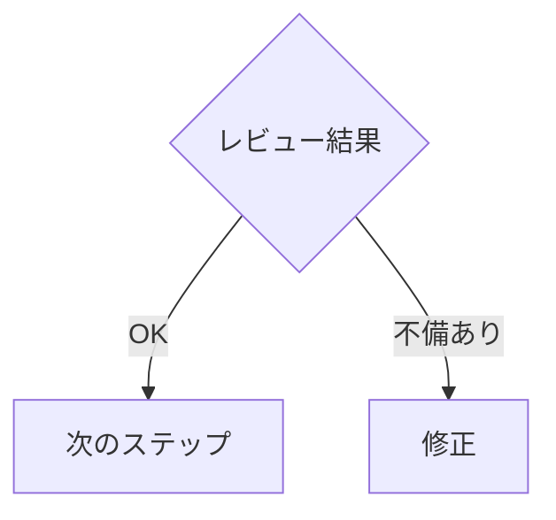
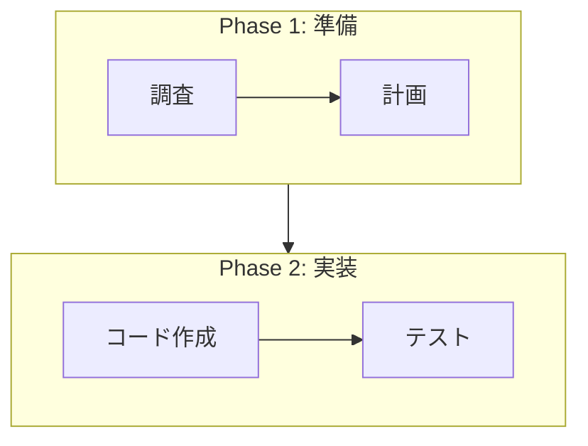

# Mermaid 図作成ルール

## 基本ルール

**Markdown ドキュメント内の図は Mermaid で描く。ASCII アートは禁止。**

| 理由 | 説明 |
|------|------|
| 構造の明示性 | 分岐条件・矢印・ラベルが構文で表現され曖昧さがない |
| AI の可読性 | LLM がテキストとして正確にパースできる |
| 人間の可読性 | GitHub・VS Code 等で自動レンダリングされる |
| 保守性 | ノード追加・分岐変更が容易で壊れにくい |

---

## 使い分けガイド

| 用途 | Mermaid 図の種類 | 例 |
|------|-----------------|-----|
| 処理フロー・手順 | `flowchart TD` | 開発フロー、デプロイ手順 |
| 左右の流れ・パイプライン | `flowchart LR` | データパイプライン、変換フロー |
| API やり取り・通信 | `sequenceDiagram` | エージェント間通信、HTTP リクエスト |
| クラス構成・データ構造 | `classDiagram` | モジュール構成、型定義 |
| 状態遷移 | `stateDiagram-v2` | タスク状態、セッション状態 |
| 階層関係 | `graph TD` | 組織図、依存関係 |

---

## 書き方のルール

### ノード ID

- **英数字の短い camelCase** を使う（例: `selfReview`, `codexCheck`）
- 連番プレフィックスで順序を示してよい（例: `S1`, `S2`）

### ラベル

- **日本語ラベル**を角括弧 `[]` や中括弧 `{}` 内に書く
- 例: `S1[調査]`, `S6{セルフレビュー}`

### 分岐

- 判定ノードは菱形 `{}` を使う
- 分岐先にはラベルで条件を明記する

### インデント・改行

- ノード定義とエッジ定義を見やすく整理する
- 長い図は `subgraph` でグループ化する

---

## 既存 ASCII 図の扱い

変更対象のファイルに ASCII アートの図（罫線文字 `─│┌┐└┘├┤` やハイフン・パイプ `- | + *` で描かれた図）がある場合:

1. **同じファイルを編集するタスクであれば**、Mermaid に置き換える
2. **別ファイルの ASCII 図を発見した場合**は、置き換えを提案する（勝手に変更しない）
3. 置き換え時は元の図が表現していた情報を欠落なく Mermaid に移すこと
